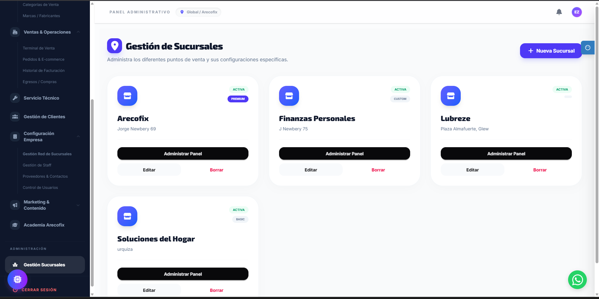
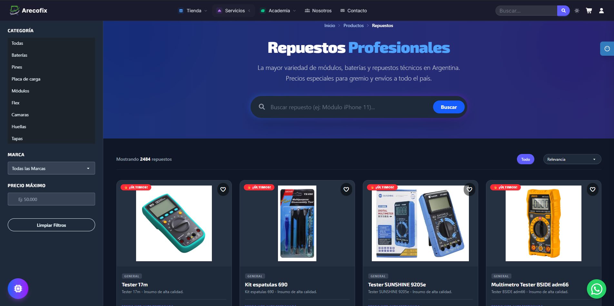
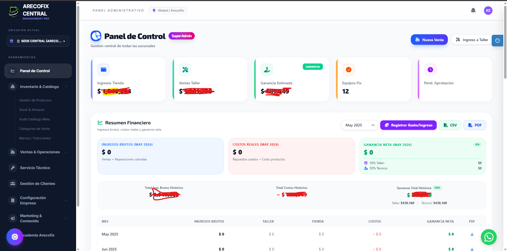
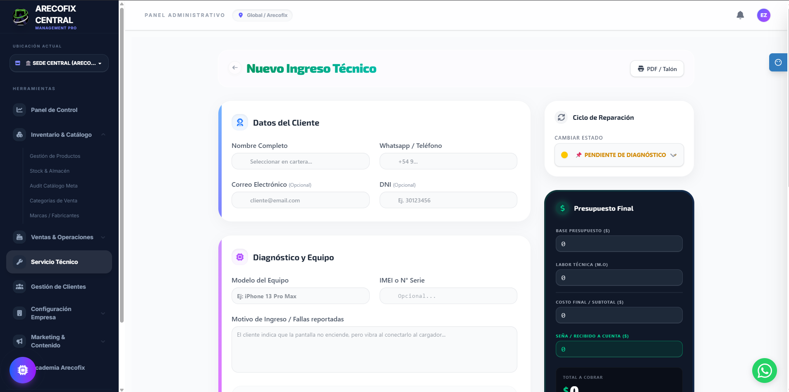
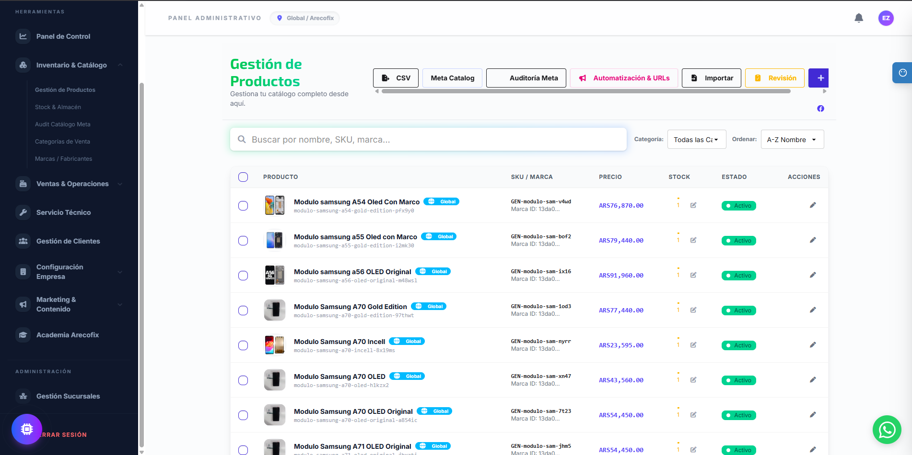
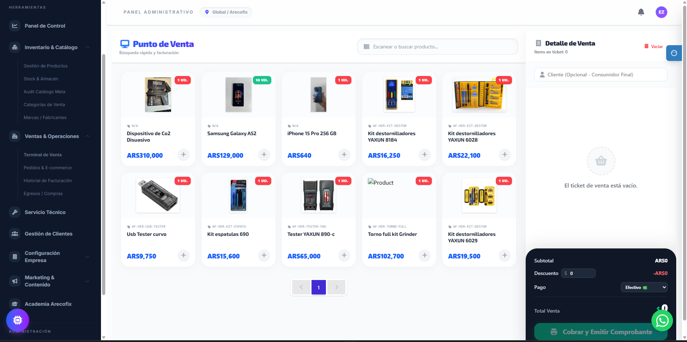

# 🔧 Arecofix

**Plataforma web de servicios de reparación, venta de repuestos y capacitación técnica.**

[](https://angular.dev)
[](https://firebase.google.com)
[](https://supabase.com)
[](LICENSE)

## � Arecofix es un software listo para vender
Arecofix combina tienda de repuestos, gestión de talleres, administración de sucursales y academia técnica en una sola plataforma. Está pensado para convertir visitantes en clientes y ofrecer una experiencia profesional para negocios de reparación.

## 📸 Capturas

| Gestión de sucursales | Dashboard operativo | Detalle de servicio |
|---|---|---|
|  |  |  |

| Catálogo de repuestos | Academia y cursos | Vista móvil |
|---|---|---|
|  |  |  |

---

## 📋 Descripción

Arecofix es una aplicación web progresiva (PWA) para un servicio técnico de reparación de dispositivos electrónicos. Incluye:

- **Catálogo de productos** — Repuestos y accesorios con búsqueda dinámica y filtros por categoría.
- **Servicios de reparación** — Sistema de órdenes de taller y seguimiento de reparaciones.
- **Academia** — Plataforma de cursos y capacitaciones en reparación de celulares.
- **Blog** — Artículos y recursos técnicos para la comunidad.
- **Panel administrativo** — Gestión de productos, pedidos y clientes.

## 🛠️ Stack Tecnológico

| Capa | Tecnología |
|------|-----------|
| **Frontend** | Angular 21 · TailwindCSS 4 · DaisyUI 5 |
| **Backend** | Supabase (PostgreSQL + Auth + RLS) |
| **Hosting** | Firebase Hosting |
| **Mobile** | Capacitor (Android) |
| **Desktop** | Tauri |
| **CI/CD** | GitHub Actions → Firebase Deploy |
| **SEO** | SSR + Prerendering con `@angular/ssr` |
| **Analytics** | PostHog |

## 🚀 Inicio Rápido

### Requisitos previos

- [Node.js](https://nodejs.org/) v20+
- [pnpm](https://pnpm.io/) v9+

### Instalación

```bash
# Clonar repositorio
git clone https://github.com/arecofix/Arecofixpage.git
cd Arecofixpage

# Instalar dependencias
pnpm install
```

### Desarrollo

```bash
# Servidor de desarrollo
pnpm start

# Generar rutas SEO (requiere .env con SUPABASE_URL y SUPABASE_KEY)
pnpm run routes:update
```

### Build de Producción

```bash
# Build + deploy a Firebase
pnpm run firebase:deploy

# Solo build
pnpm run build
```

## 📁 Estructura del Proyecto

```
Arecofixpage/
├── src/                    # Código fuente Angular
│   ├── app/                # Componentes, servicios, guards, pipes
│   ├── assets/             # Imágenes, fuentes, CSS
│   └── environments/       # Variables de entorno
├── public/                 # Assets estáticos (robots.txt, sitemap, etc.)
├── scripts/                # Scripts de utilidad (SEO sync, preloads cleanup)
├── android/                # Proyecto Capacitor Android
├── src-tauri/              # Proyecto Tauri Desktop
├── supabase/               # Migraciones y funciones edge de Supabase
├── .github/workflows/      # CI/CD con GitHub Actions
├── angular.json            # Configuración de Angular
├── firebase.json           # Configuración de Firebase Hosting
└── capacitor.config.ts     # Configuración de Capacitor
```

## 📜 Scripts Disponibles

| Comando | Descripción |
|---------|------------|
| `pnpm start` | Servidor de desarrollo |
| `pnpm run build` | Build de producción |
| `pnpm run firebase:deploy` | Build + deploy a Firebase |
| `pnpm run routes:update` | Regenerar rutas SEO desde Supabase |
| `pnpm run tauri:dev` | Desarrollo con Tauri (desktop) |

## 🔒 Variables de Entorno

Crear un archivo `.env` en la raíz del proyecto:

```env
SUPABASE_URL=https://your-project.supabase.co
SUPABASE_KEY=your-anon-key
```

> ⚠️ **Nunca commitear credenciales.** El archivo `.env` está en `.gitignore`.

## 📄 Licencia

Este proyecto está licenciado bajo la [Licencia MIT](LICENSE).

---

**Desarrollado por [Ezequiel Enrico Areco](https://arecofix.com.ar)** — CEO de Arecofix
