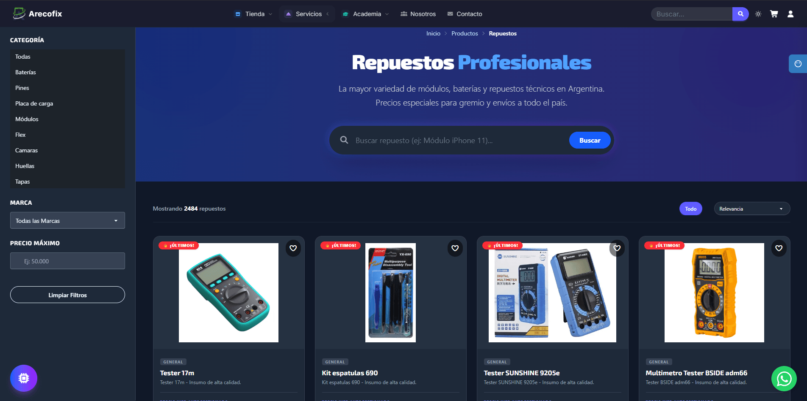
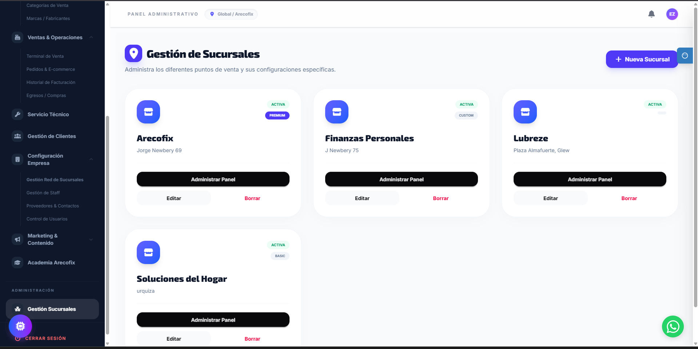
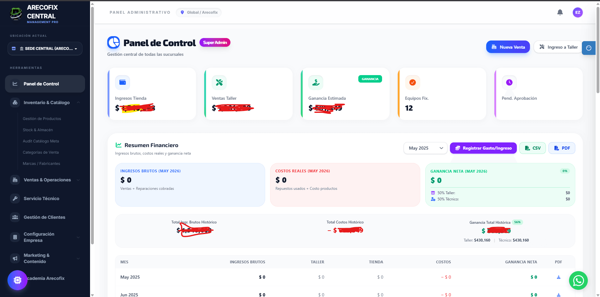
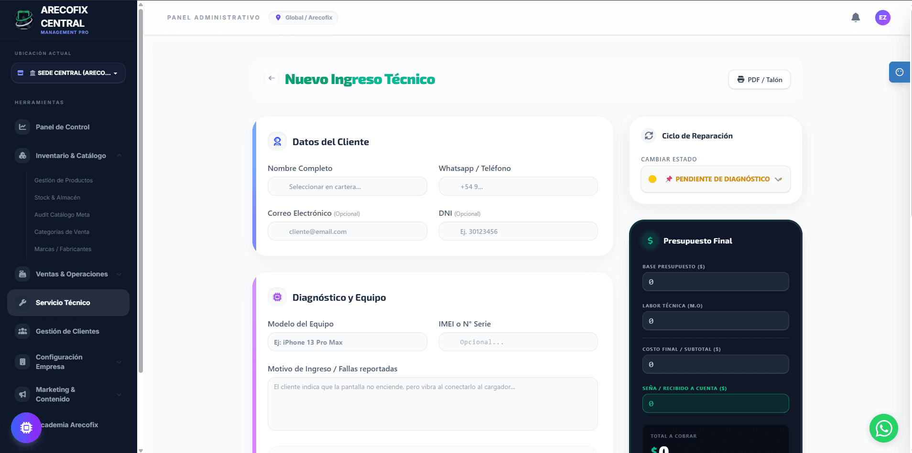
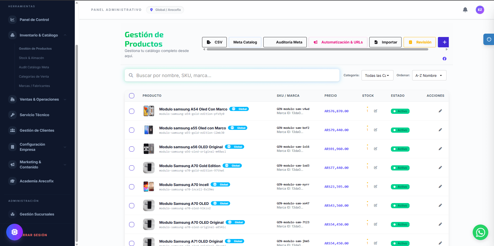
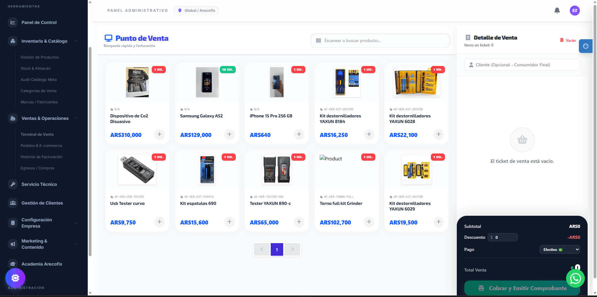
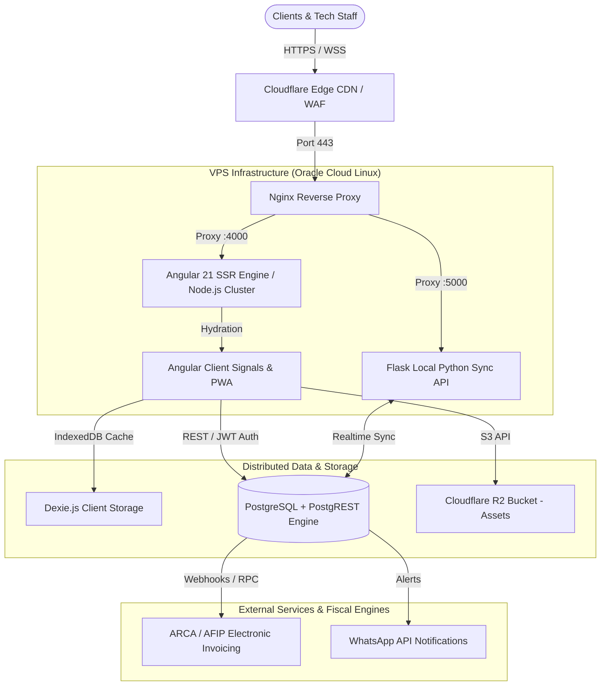

<p align="center">
  
</p>

<h1 align="center">🔧 ARECOFIX</h1>

<p align="center">
  <strong>Enterprise Multi-Tenant SaaS & E-Commerce Platform for Electronics Technical Services, POS & Hardware Academy</strong>
</p>

<p align="center">
  <a href="https://arecofix.com.ar"></a>
  <a href="https://angular.dev"></a>
  <a href="https://www.typescriptlang.org"></a>
  <a href="https://tailwindcss.com"></a>
  <a href="https://supabase.com"></a>
  <a href="https://cloudflare.com"></a>
  <a href="https://pm2.keymetrics.io"></a>
  <a href="https://jestjs.io"></a>
  <a href="https://cypress.io"></a>
</p>

---

## 🌟 Executive Overview & Business Value

**Arecofix** is a full-featured, production-hardened web ecosystem engineered to solve the operational bottlenecks of electronic device repair shops, multi-branch service centers, and technical academies. 

Operating live at **[https://arecofix.com.ar](https://arecofix.com.ar)**, it unites technical repair lifecycle tracking, ARCA/AFIP-compliant electronic invoicing, multi-tenant inventory control, and an e-learning academy into an integrated, offline-first application.

### 💼 Key Capabilities
- **🏢 Multi-Tenant SaaS Architecture**: Dynamic subdomain-based tenant and branch isolation enforced at the database level via **PostgreSQL Row-Level Security (RLS)**.
- **🛠️ SAT Workshop Repair Engine**: End-to-end device tracking from diagnostic intake to delivery, featuring digital client signatures, WhatsApp notification webhooks, and QR code tracking.
- **🧾 Point of Sale (POS) & ARCA Electronic Invoicing**: Instant emission of official AFIP/ARCA invoices (Facturas A, B, C) with automated CAE validation and printable thermal receipt layouts.
- **🛍️ E-Commerce & Inventory Management**: Catalog with dynamic variant matrices (color, storage, condition), JSONB specifications, and zero-egress asset storage on **Cloudflare R2**.
- **🎓 Technical Academy (LMS)**: Certification workflows, modular video curriculum, student evaluations, and automated certificate generation.
- **⚡ Offline-First Architecture**: Dual storage synchronization utilizing **Dexie.js (IndexedDB)** and background mutation queues for zero downtime in workshops with intermittent connectivity.
- **🚀 1-Command Atomic Deployments**: Custom automated pipeline with tarball compression, remote snapshots, PM2 cluster reloads, and self-healing rollbacks.

---

## 📸 Platform Screenshots

<div align="center">
  <table>
    <tr>
      <td width="50%">
        <br />
        <p align="center"><em>🏢 Multi-Tenant Branch Administration & Access Control</em></p>
      </td>
      <td width="50%">
        <br />
        <p align="center"><em>🔧 Workshop Orders, Diagnostics & Customer Tracking</em></p>
      </td>
    </tr>
    <tr>
      <td width="50%">
        <br />
        <p align="center"><em>🧾 Point of Sale (POS) & ARCA/AFIP Electronic Invoicing</em></p>
      </td>
      <td width="50%">
        <br />
        <p align="center"><em>🛍️ Product Catalog with Dynamic Variants & R2 Storage</em></p>
      </td>
    </tr>
    <tr>
      <td colspan="2">
        <br />
        <p align="center"><em>🎓 Arecofix Academy - Hardware Repair Certification & Video Courses</em></p>
      </td>
    </tr>
  </table>
</div>

---

## 🏛️ Architecture & Engineering Excellence

The system is constructed following **Clean Architecture**, **Domain-Driven Design (DDD)**, and the **Repository Pattern** to decouple user interface components from underlying persistence layers.


```mermaid
graph TD
    User([Clients & Tech Staff]) -->|HTTPS / WSS| CF[Cloudflare Edge CDN / WAF]
    CF -->|Port 443| Nginx[Nginx Reverse Proxy]
    
    subgraph Host["VPS Infrastructure (Oracle Cloud Linux)"]
        Nginx -->|Proxy :4000| SSR[Angular 21 SSR Engine / Node.js Cluster]
        SSR -->|Hydration| Browser[Angular Client Signals & PWA]
        Nginx -->|Proxy :5000| Flask[Flask Local Python Sync API]
    end

    subgraph Persistence["Distributed Data & Storage"]
        Browser -->|IndexedDB Cache| Dexie[Dexie.js Client Storage]
        Browser -->|REST / JWT Auth| DB[(PostgreSQL + PostgREST Engine)]
        Browser -->|S3 API| R2[Cloudflare R2 Bucket - Assets]
        Flask <-->|Realtime Sync| DB
    end

    subgraph Integrations["External Services & Fiscal Engines"]
        DB -->|Webhooks / RPC| ARCA[ARCA / AFIP Electronic Invoicing]
        DB -->|Alerts| WA[WhatsApp API Notifications]
    end
```

### 🧱 Clean Architecture Layers

```
src/app/
├── core/                        # Global singletons, auth tokens, HTTP interceptors & guards
│   ├── guards/                  # authGuard, roleGuard, tenantOwnerGuard, branchAdminGuard
│   ├── interceptors/            # Auth JWT, timeout backoff, error normalization
│   └── services/                # Supabase client, offline sync, logging & analytics
│
├── features/                    # Domain Bounded Contexts
│   ├── products/                # Domain models, PostgREST repositories, catalog UI
│   ├── sales/                   # Invoicing, POS cash registers, ARCA fiscal receipts
│   ├── repairs/                 # Workshop tickets, diagnostic workflows, device states
│   ├── academy/                 # Course lessons, student enrollments, exam evaluators
│   └── branches/                # Multi-tenant branch switching & access controls
│
├── shared/                      # Reusable UI primitives, pipes, modal handlers
└── admin/                       # Administrative back-office management dashboards
```

> 📖 **Deep Dive Documentation:** Read the full architectural analysis in [docs/architecture.md](docs/architecture.md).

---

## 🛠️ Technology Stack Breakdown

| Layer | Technologies & Libraries | Rationale & Architectural Purpose |
|---|---|---|
| **Frontend Framework** | **Angular 21** (`@angular/ssr`, standalone) | SSR for sub-second FCP, SEO prerendering, and fine-grained reactivity via Angular Signals. |
| **Language & Typing** | **TypeScript 6.0** (Strict Mode) | Zero `any` policy, exhaustive domain modeling, strict type-guards. |
| **Styling & Design** | **TailwindCSS 4** + **DaisyUI 5** | Utility-first responsive design, modern dark/light theming, zero CSS bloat. |
| **Database & Auth** | **PostgreSQL** + **PostgREST** + **Supabase** | Kernel-enforced Row-Level Security (RLS), ACID transactions, instant REST generation. |
| **Asset Storage** | **Cloudflare R2** (S3 compatible) | Zero egress fees, global edge distribution for high-resolution repair & product images. |
| **Edge & CDN** | **Cloudflare Workers** + CDN + WAF | SSL termination, DDoS protection, geo-routing, and smart edge caching. |
| **Reverse Proxy** | **Nginx** (Ubuntu Linux) | Real-IP restoration, static asset micro-caching, Gzip compression, and HTTP/2 proxy. |
| **Process Manager** | **PM2** (`ecosystem.config.cjs`) | Auto-restart on memory thresholds (>600MB), log rotation, and cluster uptime guarantees. |
| **Testing Suite** | **Jest** + **Cypress E2E** + **k6** | 30 unit test suites, browser automation specs, and API load testing. |
| **Mobile & Desktop** | **Capacitor 8** (Android) & **Tauri 2** (Desktop) | Cross-platform reach sharing 100% of the Angular codebase with native OS access. |

---

## ⚡ 1-Command Automated Deployment

Forget complex multi-step deployment rituals. The entire production pipeline is orchestrated into **1 command**:

```bash
pnpm run deploy
```

### What happens under the hood?
1. 🧪 **Validation**: Checks local environment and SSH deployment key authorization.
2. 🏗️ **Angular SSR Build**: Compiles production client and server bundles (`pnpm run build`).
3. 📦 **Atomic Tarballing**: Packages `dist/arecofix` into `dist.tar.gz` (transfer size reduced by 85%).
4. 💾 **Remote VPS Snapshot**: Automatically backs up the live version to `dist_backup/` on the server.
5. 🚀 **Encrypted SCP Transfer**: Ships the package across the secure SSH tunnel (`ssh.arecofix.com.ar`).
6. 🔄 **Atomic Extraction & PM2 Reload**: Extracts files and executes zero-downtime `pm2 reload arecofix-frontend`.
7. 🩺 **Automated Healthcheck**: Tests `https://arecofix.com.ar` for HTTP 200/301 responses.
   - **Self-Healing Guarantee**: If the server fails to respond, it automatically triggers an **instant rollback** from `dist_backup`.

### Operational Commands

```bash
# 🚀 Despliegue maestro a producción
pnpm run deploy

# ⚡ Despliegue rápido (omite compilación local si ya existe dist/)
pnpm run deploy:quick

# ⏪ Rollback inmediato de emergencia (< 2 segundos)
pnpm run deploy:rollback

# 🩺 Healthcheck en vivo de latencia y estado PM2
pnpm run healthcheck

# 🖥️ Monitoreo remoto de procesos PM2
pnpm run pm2:status
pnpm run pm2:logs
pnpm run pm2:restart
```

> 📖 **DevOps & SRE Runbook:** Full server setup and Nginx configuration detailed in [docs/deployment.md](docs/deployment.md).

---

## 🧪 Testing & Quality Assurance

Quality is enforced at every layer of the architecture:

```bash
# Ejecutar suite de pruebas unitarias (Jest)
pnpm test

# Modo interactivo / TDD
pnpm test:watch

# Generar reporte de cobertura de código
pnpm test:coverage

# Ejecutar tests E2E con Cypress
pnpm run test:e2e

# Abrir Cypress Test Runner interactivo
pnpm run cypress:open
```

- **Unit Tests (Jest)**: 30 test suites (150+ assertions) testing mappers, services, interceptors, and compensating transactions.
- **E2E Forensic Tests (Cypress)**: Automated user journeys intercepting PostgREST network calls, form validations, and multi-tenant catalog updates.
- **Load Testing (k6)**: Stress testing API endpoints under simulated peak loads.

---

## 🚀 Local Development Setup

### Prerequisites
- [Node.js](https://nodejs.org/) v22+
- [pnpm](https://pnpm.io/) v9+
- [Git](https://git-scm.com/)

### Step-by-Step Installation

```bash
# 1. Clonar el repositorio
git clone https://github.com/arecofix/Arecofixpage.git
cd Arecofixpage

# 2. Instalar dependencias
pnpm install

# 3. Configurar variables de entorno
cp .env.example .env
# Completa tus credenciales de Supabase / Base de datos en .env

# 4. Iniciar servidor de desarrollo
pnpm start
# La aplicación estará disponible en http://localhost:4200
```

---

## 📂 Project Structure

```
Arecofixpage/
├── src/
│   ├── app/
│   │   ├── admin/           # Administrative panels (Sales, Products, Repairs, Branches)
│   │   ├── core/            # Core services, auth guards, interceptors, error handling
│   │   ├── features/        # Clean Architecture domain modules (Products, Sales, Repairs)
│   │   ├── shared/          # Reusable UI components, pipes, design tokens
│   │   ├── app.config.ts    # Dependency Injection providers & Repository bindings
│   │   └── app.routes.ts    # Lazy-loaded route registry
│   ├── server.ts            # Angular Express SSR bootstrap
│   └── environments/        # Target configuration profiles
├── docs/                    # Technical architecture, database schemas & Nginx templates
│   ├── architecture.md      # Clean Architecture & DDD specifications
│   ├── deployment.md        # Complete DevOps & SRE runbook
│   ├── database.md          # Database schema & RLS policies
│   └── nginx/arecofix.conf  # Production Nginx reverse proxy configuration
├── scripts/                 # Automation scripts (deploy.mjs, healthcheck.mjs, rollback.mjs)
├── cypress/                 # Automated E2E test suites
├── supabase/                # PostgreSQL migrations, schema DDL & seed data
├── ecosystem.config.cjs     # PM2 process management configuration
└── package.json             # Scripts & dependency definitions
```

---

## 🔒 Security Best Practices

- **Zero Committed Secrets**: All secrets and credentials are fully isolated in environment variables. The `.gitignore` is rigorously segmented into 8 protection categories.
- **No SQL Injections**: All queries are sanitized and parameterized via PostgREST and domain mappers with column whitelisting.
- **Tenant Isolation**: Row-Level Security (RLS) ensures that even in the event of an application logic anomaly, the database engine prohibits cross-tenant data access.
- **Strict HTTPS & HSTS**: Nginx forces TLS 1.3, HSTS preloading, secure cookies, and Cloudflare Authenticated Origin Pulls.

---

## 📄 License & Author

This project is licensed under the **MIT License** — see the [LICENSE](LICENSE) file for details.

Developed with ❤️ by **[Ezequiel Enrico Areco](https://arecofix.com.ar)**  
*Founder & Senior Full-Stack Engineer / Tech Lead*  
📫 **Contact:** [ezequiel@arecofix.com.ar](mailto:ezequiel@arecofix.com.ar) | [LinkedIn](https://linkedin.com) | [Portfolio](https://arecofix.com.ar)
